# AVR Compilation Pipeline Visual Guide

## Complete Compilation Flow

```mermaid
graph LR
    A[Source Code<br/>.c .S] --> B[Preprocessing]
    B --> C[.i .s]
    C --> D[Compilation]
    D --> E[.s Assembly]
    E --> F[Assembly]
    F --> G[.o Object]
    G --> H[Linking]
    H --> I[.elf Executable]
    I --> J[Conversion]
    J --> K[.hex Intel HEX]
    K --> L[Upload]
    L --> M[MCU Flash]
    
    style A fill:#4a90e2,color:#fff
    style C fill:#f5a623
    style E fill:#f5a623
    style G fill:#d0021b,color:#fff
    style I fill:#7ed321
    style K fill:#50e3c2
    style M fill:#9013fe,color:#fff
```

---

## Step 1: Preprocessing

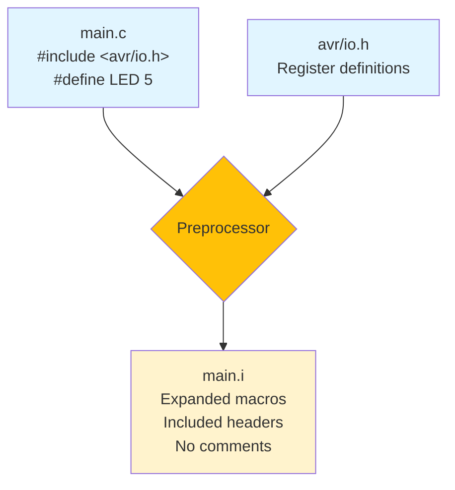

### Input: `main.c`
```c
#include <avr/io.h>
#define LED_PIN 5

int main(void) {
    DDRB |= (1 << LED_PIN);
}
```

### Command
```bash
avr-gcc -E -mmcu=atmega328p src/main.c -o build/main.i
```

### Output: `main.i`
```c
// ... thousands of lines ...
int main(void) {
    (*(volatile uint8_t *)(0x24)) |= (1 << 5);
}
```

---

## Step 2: Compilation (C → Assembly)

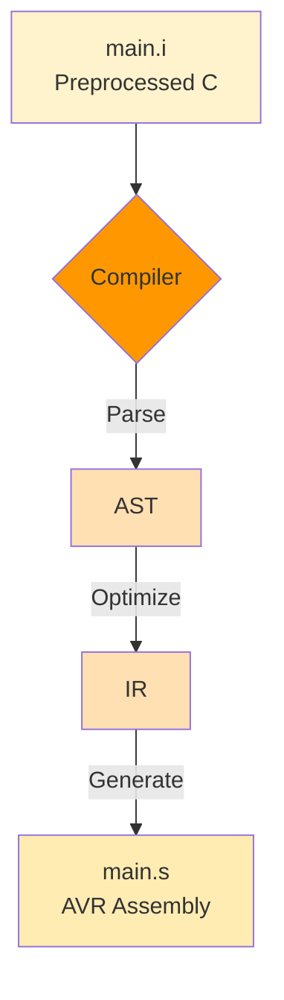

### Input: `main.c`
```c
int x = 5;
x = x + 10;
return x;
```

### Command
```bash
avr-gcc -S -mmcu=atmega328p -O2 src/main.c -o build/main.s
```

### Output: `main.s`
```asm
main:
    ldi r24, 5        ; x = 5
    subi r24, -10     ; x += 10
    ret
```

---

## Step 3: Assembly (ASM → Object)

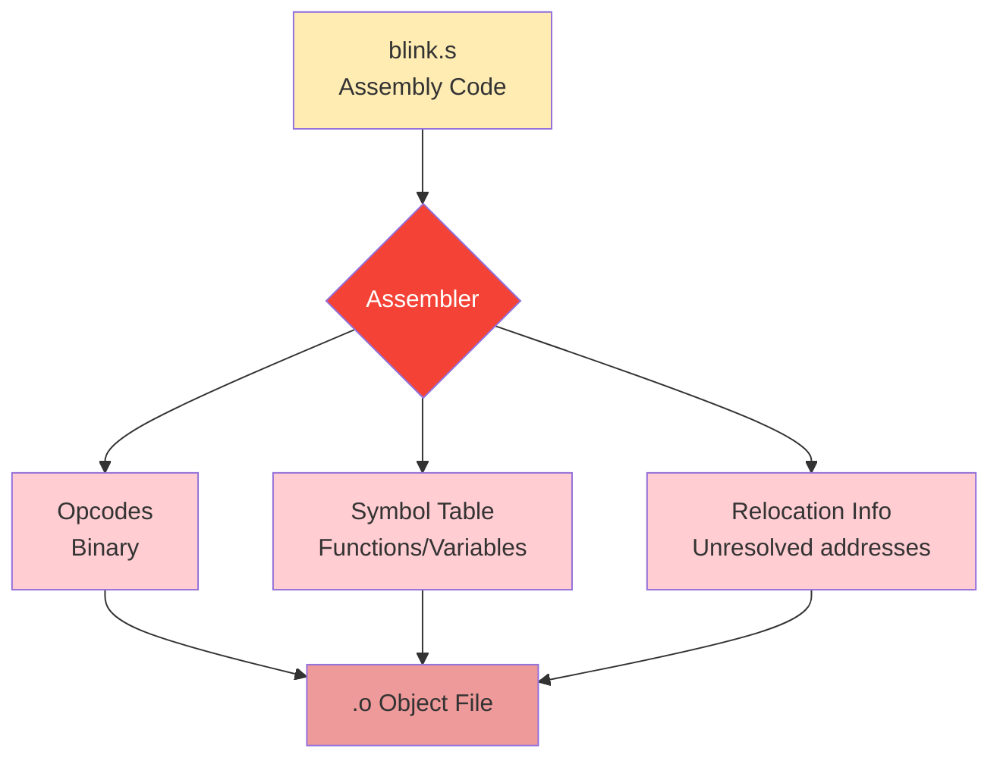

### Input: `blink.s`
```asm
.global main
main:
    sbi 0x04, 5    ; Set bit 5 in DDRB
    ret
```

### Command
```bash
avr-gcc -c -mmcu=atmega328p src/blink.s -o build/blink.o
```

### Output: `blink.o` (binary)
```
ELF Header + Sections:
  .text: 9a 5d 08 95 (machine code)
  .symtab: main @ 0x0000
  .rela.text: (relocations)
```

---

## Step 4: Linking

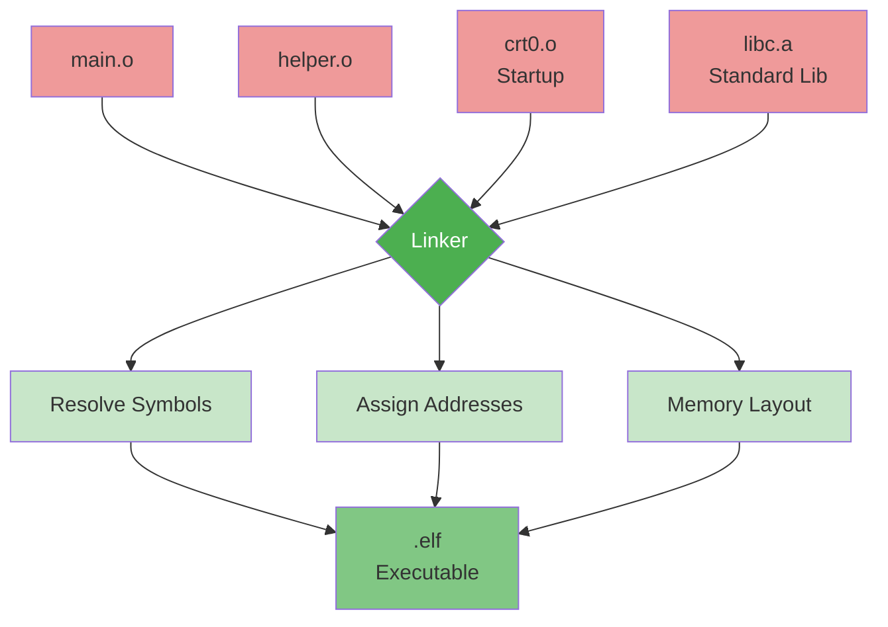

### Command
```bash
avr-gcc -mmcu=atmega328p build/main.o build/helper.o -o build/program.elf
```

---

## Memory Layout in ELF

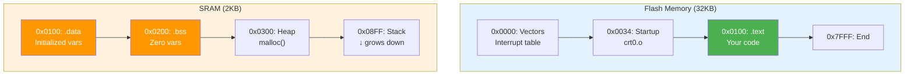

---

## ELF File Structure

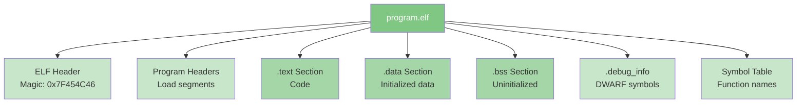

### Inspect ELF
```bash
# Size of sections
avr-size -A build/program.elf
# Output:
# section      size    addr
# .text        1234    0x00
# .data          16    0x800100
# .bss            8    0x800110

# Disassembly
avr-objdump -d build/program.elf

# Symbols
avr-nm build/program.elf
```

---

## Step 5: ELF → HEX Conversion

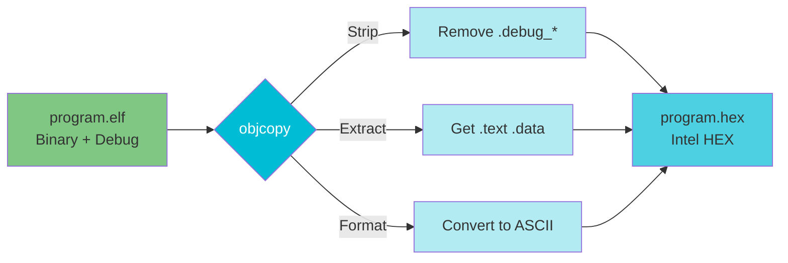

### Command
```bash
avr-objcopy -O ihex -R .eeprom build/program.elf build/program.hex
```

### HEX File Format

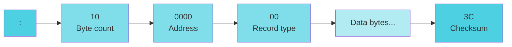

### Example: `program.hex`
```
:10000000C0000000C0000000C0000000C00000003C
:10001000C0000000C0000000C0000000C00000002C
:020020009A5D60
:00000001FF
```

**Legend:**
- `:10` = 16 bytes of data
- `0000` = address 0x0000
- `00` = data record
- `C000...` = data (16 bytes)
- `3C` = checksum

---

## Step 6: Upload to MCU

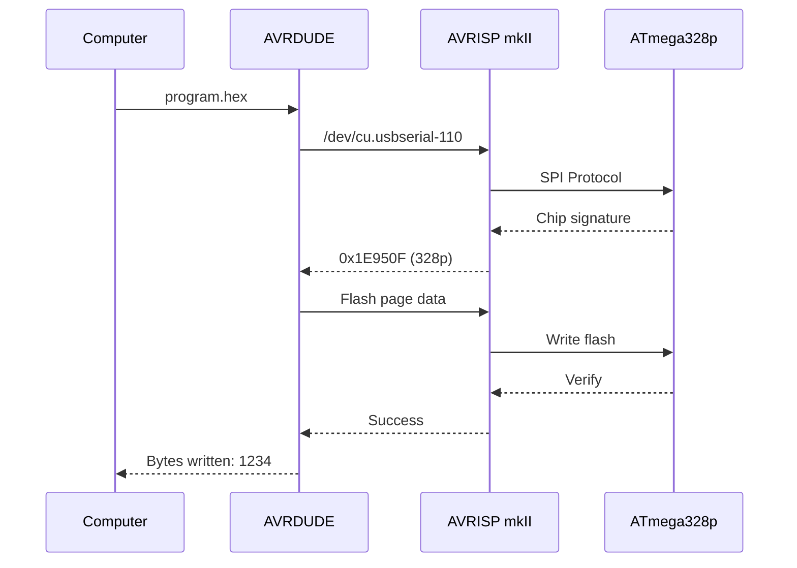

### Command
```bash
avrdude -c avrisp2 \
        -p atmega328p \
        -P /dev/cu.usbserial-110 \
        -b 19200 \
        -U flash:w:build/program.hex:i
```

---

## File Types Comparison

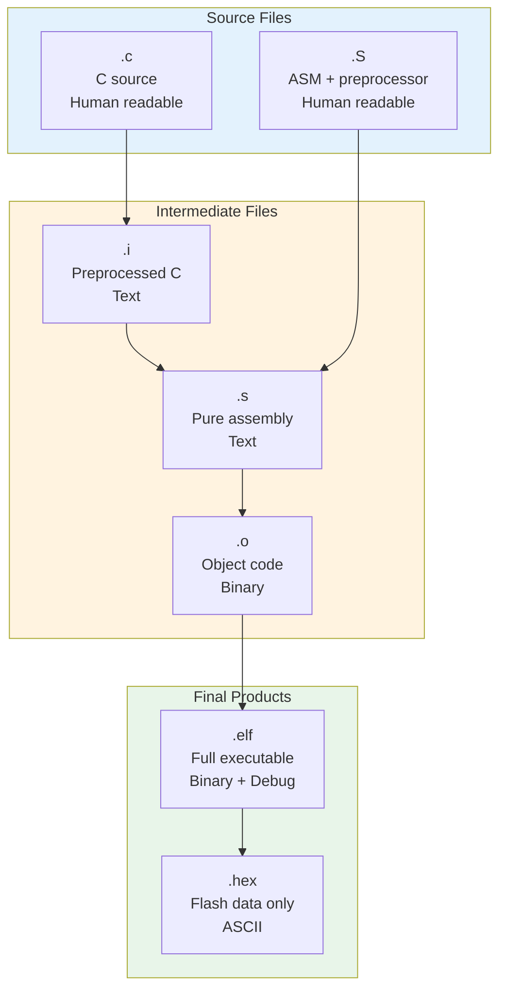

---

## Assembly Types: .S vs .s

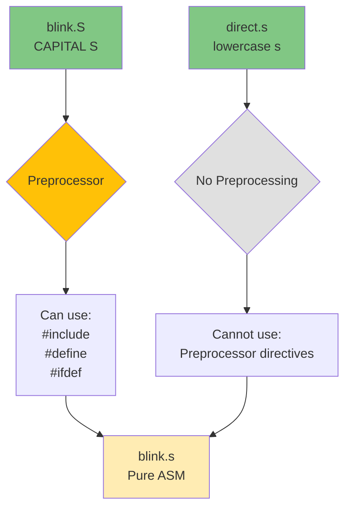

### `.S` (with preprocessor)
```asm
#include <avr/io.h>
#define LED_PIN 5

.global main
main:
    sbi _SFR_IO_ADDR(DDRB), LED_PIN
    ret
```

### `.s` (pure assembly)
```asm
.global main
main:
    sbi 0x04, 5    ; Direct address
    ret
```

---

## AVR Instruction Set Categories

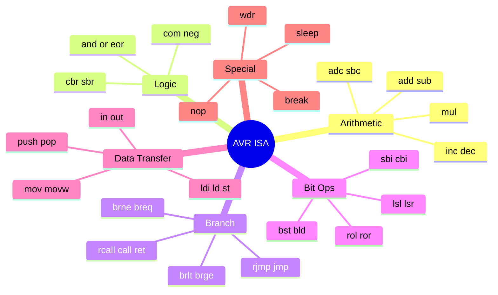

---

## AVR Register Architecture

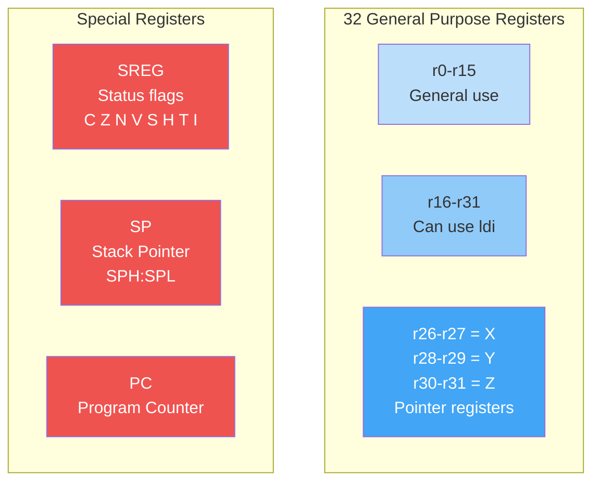

---

## Complete Build Flow

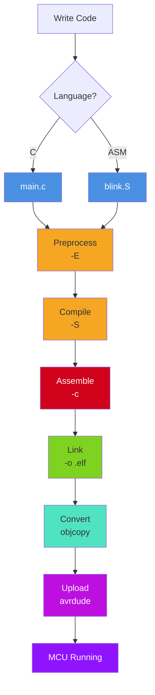

---

## Makefile Workflow

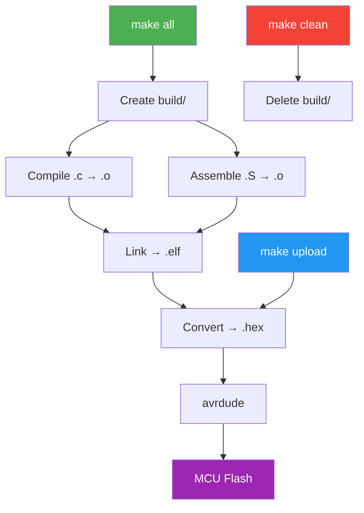

---

## Memory-Mapped I/O

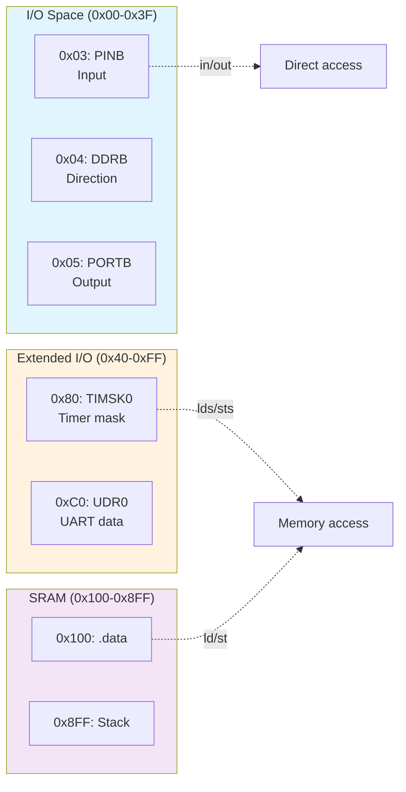

### I/O Access Examples
```asm
; Direct I/O (0x00-0x3F)
sbi 0x04, 5        ; Set bit in DDRB
in r16, 0x05       ; Read PORTB

; Extended I/O (0x40-0xFF)
lds r16, 0x0080    ; Read TIMSK0
sts 0x0080, r16    ; Write TIMSK0

; SRAM
ld r16, X          ; Load from address in X
st X, r16          ; Store to address in X
```

---

## Tool Commands Summary

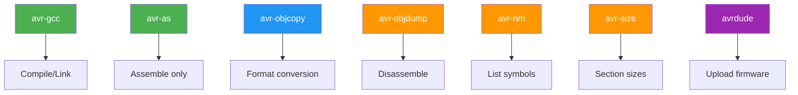

### Commands Reference

```bash
# Compile C to object
avr-gcc -c -mmcu=atmega328p -O2 src/main.c -o build/main.o

# Link to ELF
avr-gcc -mmcu=atmega328p build/main.o -o build/program.elf

# ELF to HEX
avr-objcopy -O ihex -R .eeprom build/program.elf build/program.hex

# Disassemble
avr-objdump -d build/program.elf

# List symbols
avr-nm build/program.elf

# Section sizes
avr-size -A build/program.elf

# Upload
avrdude -c avrisp2 -p atmega328p -P /dev/cu.usbserial-110 \
        -U flash:w:build/program.hex:i
```

---

## Debug Flow

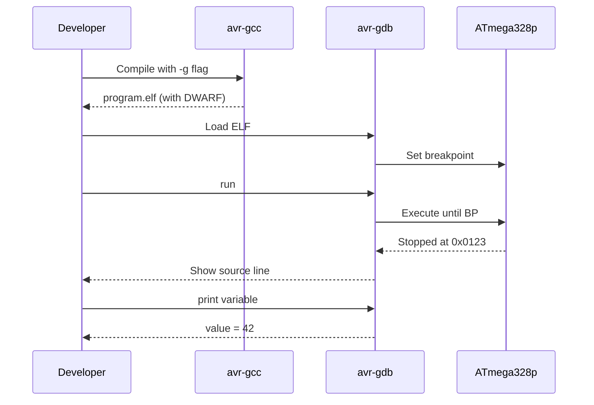

### Debug Build
```bash
# Compile with debug symbols
avr-gcc -g -O0 -mmcu=atmega328p src/main.c -o build/main.elf

# Debugger (requires hardware debugger)
avr-gdb build/main.elf
(gdb) target remote :4242
(gdb) break main
(gdb) continue
```