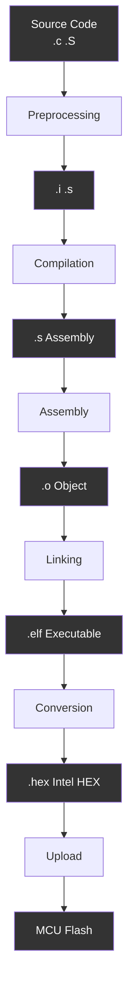
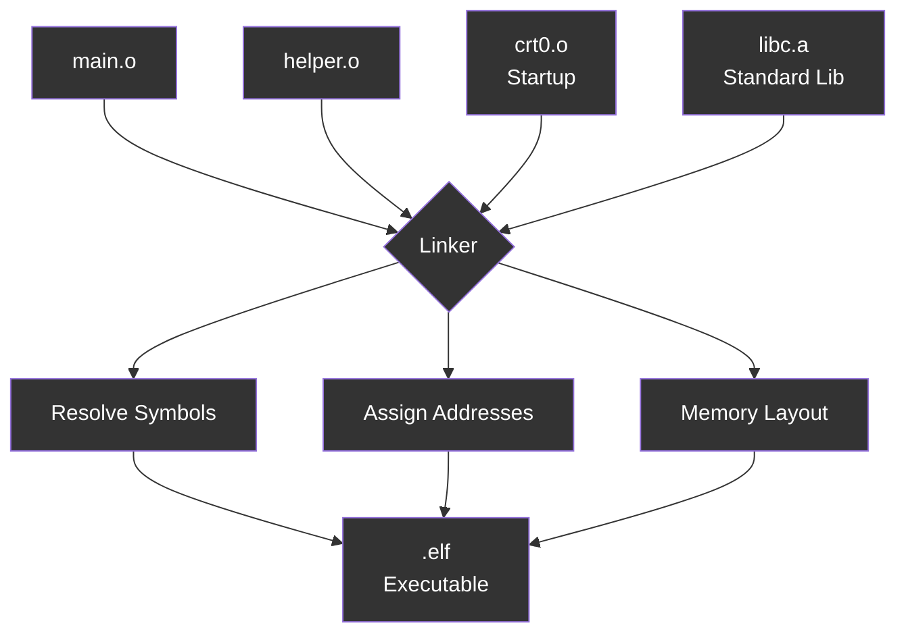
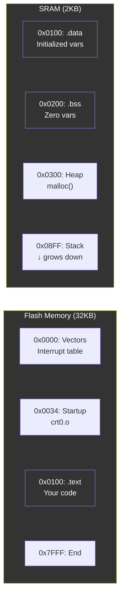
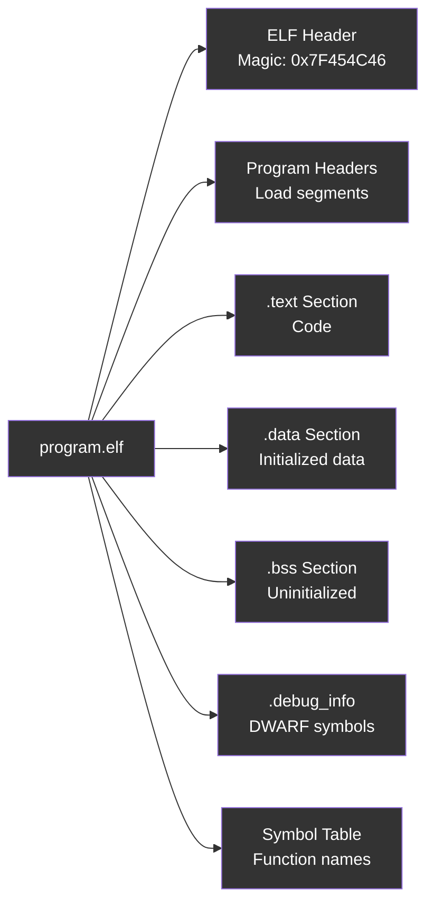
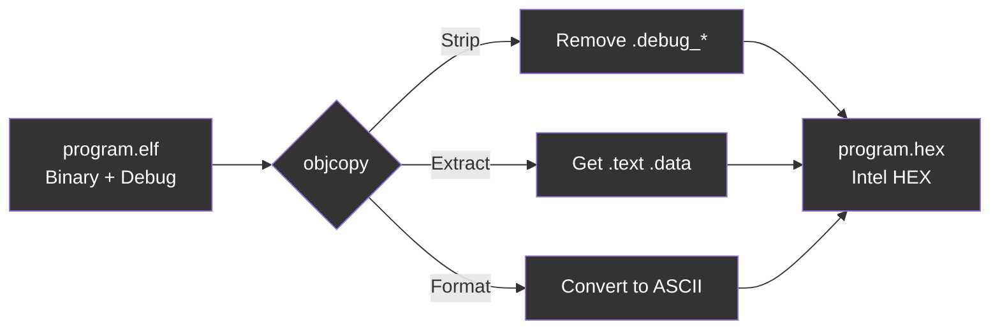
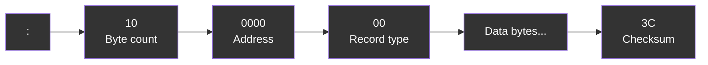
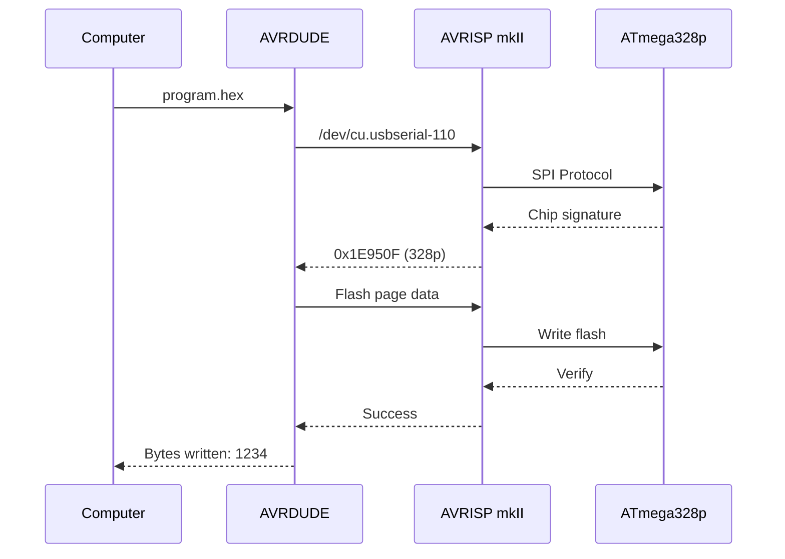
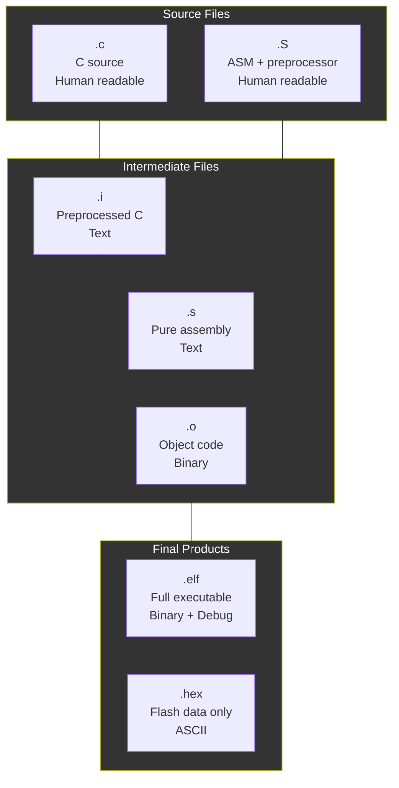
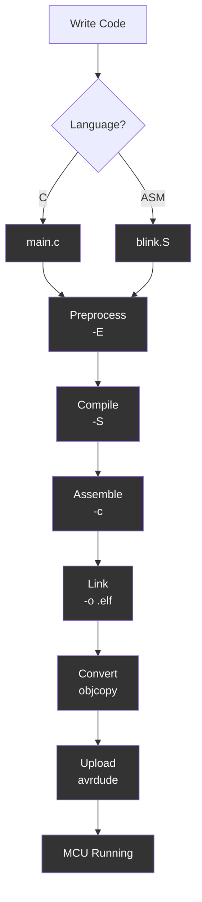

# AVR Compilation Pipeline Visual Guide

## Complete Compilation Flow



### Input: `main.c`
```c
#include <avr/io.h>
#define LED_PIN 5

int main(void) {
    DDRB |= (1 << LED_PIN);
}
```

### Command
```bash
# -E means preprocess only
avr-gcc -E -mmcu=atmega328p src/main.c -o build/main.i
```

### Output: `main.i`
```c
// ... thousands of lines ...
int main(void) {
    (*(volatile uint8_t *)(0x24)) |= (1 << 5);
}
```

---

## Step 2: Compilation (C → Assembly)

### Input: `main.c`
```c
int x = 5;
x = x + 10;
return x;
```

### Command
```bash
# -S means compile to assembly only
avr-gcc -S -mmcu=atmega328p -O2 src/main.c -o build/main.s
```

### Output: `main.s`
```asm
main:
    ldi r24, 5        ; x = 5
    subi r24, -10     ; x += 10
    ret
```

---

## Step 3: Assembly (ASM → Object)

### Input: `blink.s`
```asm
.global main
main:
    sbi 0x04, 5    ; Set bit 5 in DDRB
    ret
```

### Command
```bash
# -c means compile to object file only
avr-gcc -c -mmcu=atmega328p src/blink.s -o build/blink.o
```

### Output: `blink.o` (binary)
```
ELF Header + Sections:
  .text: 9a 5d 08 95 (machine code)
  .symtab: main @ 0x0000
  .rela.text: (relocations)
```

---

## Step 4: Linking



### Command
```bash
avr-gcc -mmcu=atmega328p build/main.o build/helper.o -o build/program.elf
```

---

## Memory Layout in ELF



---

## ELF File Structure



### Inspect ELF
```bash
# Size of sections
avr-size -A build/program.elf
# Output:
# section      size    addr
# .text        1234    0x00
# .data          16    0x800100
# .bss            8    0x800110

# Disassembly
avr-objdump -d build/program.elf

# Symbols
avr-nm build/program.elf
```

---

## Step 5: ELF → HEX Conversion



### Command
```bash
# -O ihex means output in Intel HEX format
avr-objcopy -O ihex -R .eeprom build/program.elf build/program.hex
```

### HEX File Format



### Example: `program.hex`
```
:10000000C0000000C0000000C0000000C00000003C
:10001000C0000000C0000000C0000000C00000002C
:020020009A5D60
:00000001FF
```

**Legend:**
- `:10` = 16 bytes of data
- `0000` = address 0x0000
- `00` = data record
- `C000...` = data (16 bytes)
- `3C` = checksum

---

## Step 6: Upload to MCU



### Command
```bash
avrdude -c avrisp2 \
        -p atmega328p \
        -P /dev/cu.usbserial-110 \
        -b 19200 \
        -U flash:w:build/program.hex:i
```

---

## File Types Comparison



---

## Complete Build Flow


