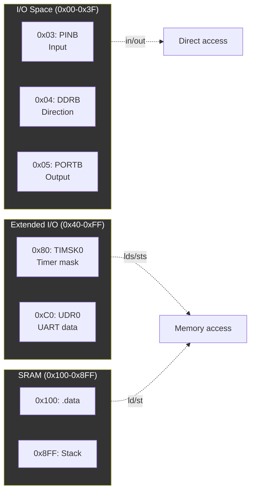

# ID F KNOW


## Memory-Mapped I/O



### I/O Access Examples
```asm
; Direct I/O (0x00-0x3F)
sbi 0x04, 5        ; Set bit in DDRB
in r16, 0x05       ; Read PORTB

; Extended I/O (0x40-0xFF)
lds r16, 0x0080    ; Read TIMSK0
sts 0x0080, r16    ; Write TIMSK0

; SRAM
ld r16, X          ; Load from address in X
st X, r16          ; Store to address in X
```

