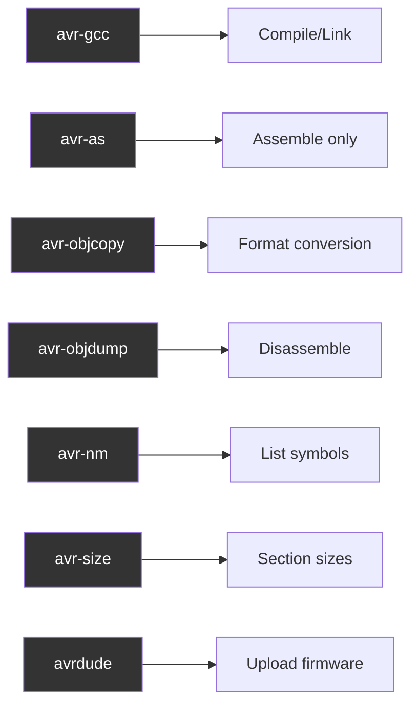
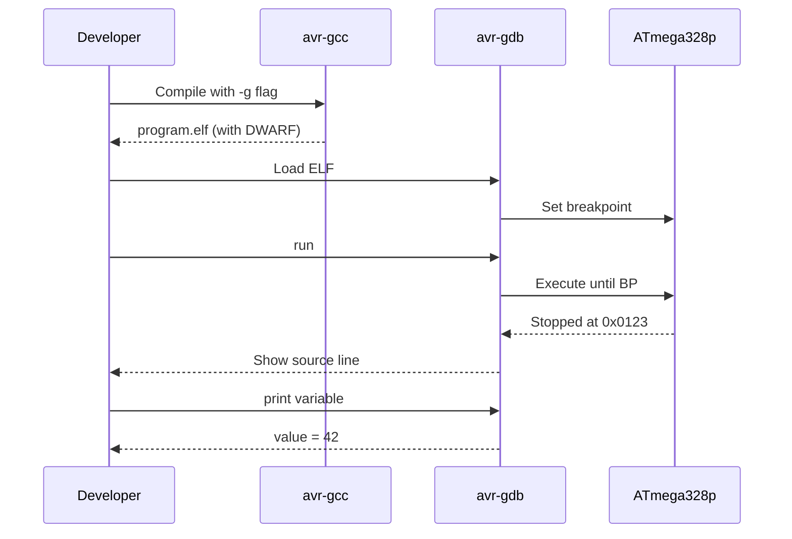

# Tool Commands Summary



## Commands Reference

```bash
# Compile C to object
avr-gcc -c -mmcu=atmega328p -O2 src/main.c -o build/main.o

# Link to ELF
avr-gcc -mmcu=atmega328p build/main.o -o build/program.elf

# ELF to HEX
avr-objcopy -O ihex -R .eeprom build/program.elf build/program.hex

# Disassemble
avr-objdump -d build/program.elf

# List symbols
avr-nm build/program.elf

# Section sizes
avr-size -A build/program.elf

# Upload
avrdude -c avrisp2 -p atmega328p -P /dev/cu.usbserial-110 \
        -U flash:w:build/program.hex:i
```
---

# Debug Flow



## Debug Build
```bash
# Compile with debug symbols
avr-gcc -g -O0 -mmcu=atmega328p src/main.c -o build/main.elf

# Debugger (requires hardware debugger)
avr-gdb build/main.elf
(gdb) target remote :4242
(gdb) break main
(gdb) continue
```